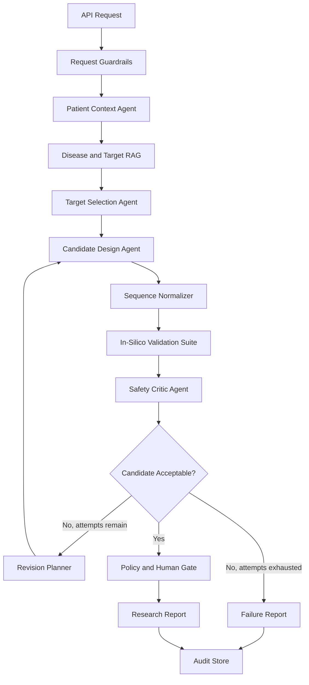

# N-of-1 Experimental Therapy Architecture

## Purpose

This architecture describes the second experimental flow in the project: a patient-specific therapy design simulation. Its purpose is to show how an agentic system could move from patient context to a candidate design, validate that candidate, revise it when validation fails, and stop at a human review gate.

This flow must be positioned as a research simulation. It must not claim to generate clinically usable mRNA therapies, autonomous treatment plans, or manufacturing-ready sequences.

## Current Baseline

The current implementation is intentionally lightweight:

- `POST /api/generate-therapy` calls `orchestrate_therapy_generation`.
- `research_patient` loads the patient profile.
- `design_mrna_therapy` returns a mocked mRNA sequence.
- `validate_mrna_sequence` returns a mocked toxicity score.
- The orchestrator retries up to three times and returns the first passing candidate.

This is useful for demonstrating a closed loop, but it is not enough for a credible n-of-1 architecture.

## Target System Shape



## Core Principle

The system should not be "LLM generates therapy." The stronger architecture is:

> Patient context plus retrieved disease evidence plus constrained candidate generation plus deterministic validation plus critic review plus human gate.

The LLM can propose and explain candidates, but validation and stop/go decisions should be handled by deterministic checks, explicit thresholds, source-backed evidence, and clinician/researcher review.

## Proposed Agents

### 1. Request Guardrails

Validates the incoming request before the graph starts.

Responsibilities:

- Confirm `patient_id` exists.
- Confirm `target_disease` is allowed for research simulation.
- Reject requests that ask for clinical deployment, dosing, manufacturing, or autonomous treatment.
- Create a `therapy_request_id`.

### 2. Patient Context Agent

Builds a patient-specific context object.

Inputs:

- Patient profile
- Indication
- CYP profiles
- Prior evaluations
- Check-ins and reported side effects
- Relevant allergies or contraindication fields when available

Output:

```python
PatientTherapyContext = {
    "patient_id": str,
    "display_name": str,
    "indication": str,
    "cyp_profiles": list[dict],
    "clinical_history_summary": str,
    "safety_constraints": list[str],
}
```

### 3. Disease and Target RAG

Retrieves evidence for the target disease and candidate biological target.

Initial demo sources can be local markdown files. A stronger version can later add curated sources such as disease briefs, gene summaries, local research policies, and reviewed publication notes.

Output:

```python
EvidenceBundle = {
    "sources": list[str],
    "target_rationale": str,
    "known_risks": list[str],
    "open_questions": list[str],
    "evidence_quality": "low" | "moderate" | "high",
}
```

### 4. Target Selection Agent

Chooses the simulated therapeutic target.

Responsibilities:

- Identify the disease mechanism or target protein.
- Explain why the target is relevant to this patient.
- Record uncertainty and missing evidence.
- Refuse target selection if evidence is too weak.

Output:

```python
TargetProfile = {
    "target_name": str,
    "target_type": "protein" | "transcript" | "pathway" | "unknown",
    "rationale": str,
    "evidence_refs": list[str],
    "confidence": float,
}
```

### 5. Candidate Design Agent

Generates a constrained research candidate, not a clinical therapy.

Responsibilities:

- Produce a simulated mRNA candidate.
- State design assumptions.
- Include constraints used during generation.
- Include known limitations.
- Avoid clinical approval language.

Output:

```python
CandidateDesign = {
    "candidate_id": str,
    "iteration": int,
    "modality": "simulated_mrna",
    "sequence": str,
    "design_constraints": list[str],
    "rationale": str,
    "evidence_refs": list[str],
}
```

### 6. Sequence Normalizer

Runs deterministic syntax checks before deeper validation.

Checks:

- Allowed RNA alphabet only: `A`, `U`, `G`, `C`
- Starts with `AUG`
- Contains a terminal stop codon
- No internal stop codons in the coding region
- Length within configured demo bounds
- Sequence metrics are reproducible

Output:

```python
SequenceMetrics = {
    "length": int,
    "gc_content": float,
    "start_codon_valid": bool,
    "terminal_stop_valid": bool,
    "internal_stop_count": int,
    "repeat_risk": float,
}
```

### 7. In-Silico Validation Suite

Replaces the current random toxicity check with a reproducible scoring pipeline.

Demo validators:

- RNA syntax validator
- GC content range check
- Repeated motif check
- Internal stop codon check
- Length bounds check
- Simple immunogenic motif heuristic
- Simple off-target placeholder score

Future validators:

- Secondary structure prediction
- Homology search
- Immunogenicity model
- Protein translation validation
- Delivery and tissue-targeting constraints
- Manufacturing feasibility checks

Output:

```python
ValidationResult = {
    "passed": bool,
    "overall_risk_score": float,
    "checks": list[dict],
    "blocked_reasons": list[str],
    "revision_hints": list[str],
}
```

### 8. Safety Critic Agent

Challenges the candidate after validation.

Responsibilities:

- Identify weak evidence.
- Detect overconfident language.
- Confirm validation failures are not ignored.
- Require human review even when validation passes.
- Produce explicit unresolved risks.

Output:

```python
TherapyCritique = {
    "verdict": "revise" | "research_review_required" | "failed",
    "summary": str,
    "unresolved_risks": list[str],
    "required_review_fields": list[str],
    "confidence": float,
}
```

### 9. Revision Planner

Converts validation and critic feedback into structured constraints for the next candidate.

Examples:

- Reduce GC content.
- Avoid repeated motifs.
- Shorten candidate length.
- Remove internal stop codon.
- Increase evidence support before retry.

The graph should enforce a maximum iteration count, normally `3`.

### 10. Policy and Human Gate

The final gate must always remain pending for human review.

Required fields:

- Reviewer identity
- Research rationale
- Evidence review attestation
- Safety risk acknowledgement
- Decision: continue research, revise, or reject

The response should say "candidate ready for research review", not "therapy approved."

## Graph State

If LangGraph is used, the state should be explicit:

```python
TherapyGraphState = {
    "therapy_request_id": str,
    "patient_id": str,
    "target_disease": str,
    "patient_context": dict | None,
    "evidence_bundle": dict | None,
    "target_profile": dict | None,
    "candidate_history": list[dict],
    "active_candidate": dict | None,
    "sequence_metrics": dict | None,
    "validation_result": dict | None,
    "critique": dict | None,
    "iteration": int,
    "max_iterations": int,
    "status": str,
    "human_gate": dict,
    "audit_events": list[dict],
}
```

## Branching Rules

```text
validation failed + iteration < max_iterations
  -> Revision Planner -> Candidate Design

validation failed + iteration >= max_iterations
  -> Failure Report

validation passed + critic says revise
  -> Revision Planner -> Candidate Design

validation passed + critic accepts for research review
  -> Policy and Human Gate -> Research Report

evidence quality too low
  -> Failure Report with "insufficient evidence"
```

## Storage Model

The system should store every step, not only the final candidate.

Suggested tables or JSON sections:

- `therapy_requests`
- `therapy_candidates`
- `therapy_validation_results`
- `therapy_audit_events`
- `therapy_human_reviews`

Each candidate should have:

- Candidate ID
- Iteration
- Sequence
- Metrics
- Validation checks
- Critic findings
- Evidence references
- Created timestamp

## API Shape

### Request

```json
{
  "patient_id": "PGX-001",
  "target_disease": "example condition",
  "max_iterations": 3
}
```

### Response

```json
{
  "status": "research_review_required",
  "patient_id": "PGX-001",
  "target_disease": "example condition",
  "candidate_id": "therapy-cand-001",
  "iterations": 2,
  "final_candidate": {
    "modality": "simulated_mrna",
    "sequence": "AUG...",
    "design_constraints": []
  },
  "validation_result": {
    "passed": true,
    "overall_risk_score": 0.32,
    "blocked_reasons": []
  },
  "human_gate": {
    "required": true,
    "status": "pending",
    "reason": "Researcher or clinician review required before any downstream use."
  },
  "safety_notes": [
    "Research simulation only.",
    "Not clinically validated.",
    "Not for autonomous treatment or manufacturing."
  ]
}
```

## Implementation Phases

### Phase 1: Credible Simulation

- Replace random toxicity with deterministic validators.
- Add candidate history.
- Add structured validation output.
- Add explicit human gate to `TherapyGenerationResponse`.
- Update UI to show iterations and failed checks.

### Phase 2: Graph Orchestration

- Move the therapy loop into LangGraph.
- Add explicit graph state.
- Add conditional revision branches.
- Add checkpointing for pause/resume and audit replay.

### Phase 3: Evidence-Grounded Targeting

- Add disease and target RAG.
- Store source metadata.
- Require minimum evidence quality.
- Refuse unsupported target selection.

### Phase 4: Research-Grade Integrations

- Integrate real bioinformatics tools behind deterministic adapters.
- Add versioned validator outputs.
- Add human review records.
- Add evaluation test sets.

## What Would Make This Stand Out

The standout version is not a flashy generator. It is an auditable, clinician-gated research workflow that shows:

- Why the target was selected.
- Which evidence was used.
- What candidate was generated.
- Which validation checks failed or passed.
- How the candidate changed after feedback.
- Why the system stopped.
- What a human must review next.

That is the defensible n-of-1 story for this project.
