# Pharmacogenomic (PGx) Agent Harness

**Agentic decision support for precision prescribing and experimental therapy design.**

---

## 🚀 Overview

The Pharmacogenomic Harness is a dual-pipeline clinical AI system that provides auditable, evidence-backed support for personalized medicine. It bridges the gap between population-level clinical guidelines and patient-specific genomic data.

### Dual-Pipeline Architecture

| Pipeline | Purpose | Key Agents |
| :--- | :--- | :--- |
| **Standard Care** | PGx Evaluation | Analyst, Critic, Reporter |
| **N-of-1 Research** | Experimental Therapy Design | Design, Validation (Bioinformatics), Critic |

*All workflows feature a strict **Human Gate** to ensure clinical accountability.*

---

## 🛠 Tech Stack

- **Backend:** Python (FastAPI, LangGraph) for agentic orchestration.
- **Frontend:** Next.js (TypeScript, React) for professional clinical dashboards.
- **Data & Memory:** Supabase (PostgreSQL) for live state; Obsidian (Markdown Vault) for persistent clinical wisdom.
- **Security:** JWT-based authentication and strict Row-Level Security (RLS).

---

## 🏛 Architecture

---

## 🚀 Getting Started

1. **Clone the repo:** `git clone https://github.com/faizanmasood302/pharmaco_AI.git`
2. **Environment:** Copy `.env.example` to `agent-server/.env` and `web/.env.local`.
3. **Run stack:** `docker-compose up --build`

---

## 🔒 Security
This harness uses **Synthetic Demo Data only**. Never process real PII or PHI. See [SECURITY.md](SECURITY.md) for vulnerability reporting.
